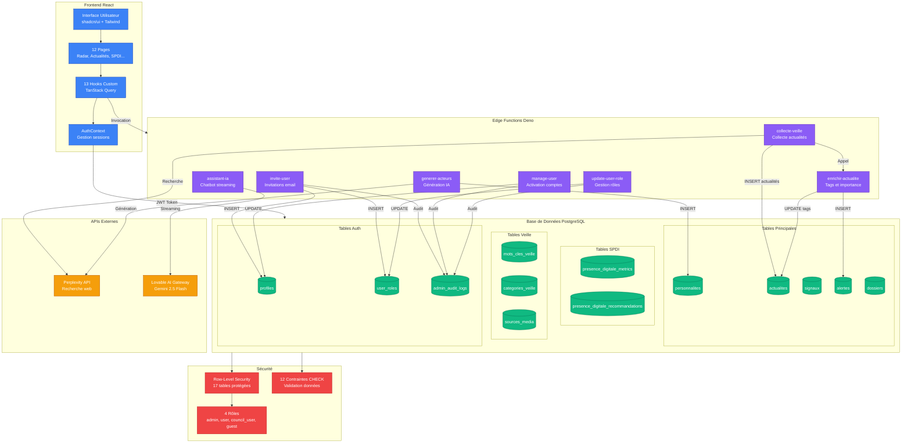
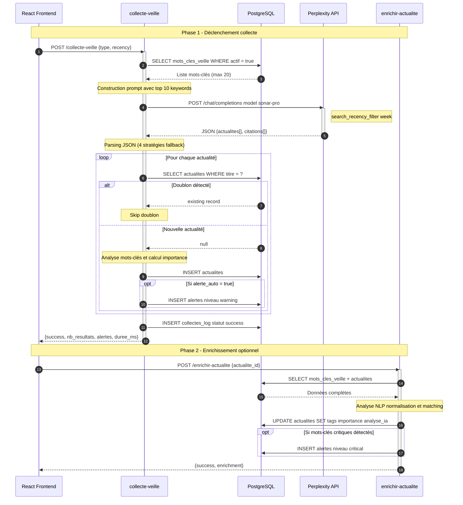

# ANSUT RADAR

**Plateforme de veille stratégique** pour l'Agence Nationale du Service Universel des Télécommunications (ANSUT) de Côte d'Ivoire.

## Périmètre fonctionnel

- 📡 **Radar stratégique** — Signaux classés par quadrant (tech, régulation, marché, réputation)
- 👥 **Suivi des acteurs télécoms** — Personnalités avec Score de Présence Digitale Institutionnelle (SPDI)
- 📰 **Collecte automatisée d'actualités** — Via Perplexity API avec enrichissement IA
- 🔔 **Système d'alertes en temps réel** — Notifications push et historique
- 🤖 **Assistant IA contextuel** — Chatbot stratégique avec streaming
- 📋 **Dossiers analytiques** — Rédaction collaborative en Markdown
- 📊 **Tableaux de bord SPDI** — Métriques, évolution, recommandations

---

## Stack Technique

| Catégorie | Technologies |
|-----------|-------------|
| Frontend | React 18.3, Vite, TypeScript |
| UI | shadcn/ui (Radix UI), Tailwind CSS, Lucide Icons |
| Charts | Recharts |
| Backend | Lovable Cloud (Supabase) |
| Edge Functions | Deno |
| APIs externes | Perplexity API, Lovable AI Gateway (Gemini 2.5 Flash) |
| État | TanStack Query v5, React Context |
| Auth | Supabase Auth + Row-Level Security (RLS) |

---

## Installation Locale

```bash
# Cloner le dépôt
git clone <REPO_URL>
cd ansut-radar

# Installer les dépendances
npm install

# Lancer le serveur de développement
npm run dev
```

### Variables d'environnement

Le fichier `.env` est auto-généré par Lovable Cloud :

```env
VITE_SUPABASE_URL=https://lpkfwxisranmetbtgxrv.supabase.co
VITE_SUPABASE_PUBLISHABLE_KEY=eyJxxx...
VITE_SUPABASE_PROJECT_ID=lpkfwxisranmetbtgxrv
```

### Secrets Edge Functions

Configurés dans Lovable Cloud (Settings > Secrets) :

| Secret | Description |
|--------|-------------|
| `PERPLEXITY_API_KEY` | API Perplexity pour collecte veille |
| `LOVABLE_API_KEY` | Gateway IA (auto-provisionné) |
| `SUPABASE_SERVICE_ROLE_KEY` | Clé admin (auto-provisionné) |

---

## Architecture Dossier

```
src/
├── pages/                        # 12 pages principales
│   ├── Index.tsx                 # Redirection vers /radar
│   ├── RadarPage.tsx             # Dashboard radar stratégique
│   ├── ActualitesPage.tsx        # Fil d'actualités
│   ├── PersonnalitesPage.tsx     # Acteurs + SPDI
│   ├── DossiersPage.tsx          # Dossiers analytiques
│   ├── AssistantPage.tsx         # Chatbot IA
│   ├── AlertesHistoryPage.tsx    # Historique alertes
│   ├── ProfilePage.tsx           # Profil utilisateur
│   ├── AuthPage.tsx              # Authentification
│   ├── ResetPasswordPage.tsx     # Reset mot de passe
│   └── admin/                    # Pages administration
│       ├── UsersPage.tsx         # Gestion utilisateurs
│       ├── MotsClesPage.tsx      # Mots-clés veille
│       ├── ImportActeursPage.tsx # Import acteurs
│       └── AuditLogsPage.tsx     # Logs d'audit
│
├── components/
│   ├── ui/                       # 50+ composants shadcn/ui
│   ├── auth/                     # ProtectedRoute, AdminRoute, LoadingScreen
│   ├── layout/                   # AppLayout, AppSidebar, AppHeader
│   ├── personnalites/            # ActeurCard, ActeurDetail, ActeurFilters
│   ├── actualites/               # FreshnessIndicator
│   ├── spdi/                     # SPDIGaugeCard, SPDIEvolutionChart, etc.
│   ├── assistant/                # ContextSelector, ConversationHistory
│   ├── dossiers/                 # DossierFormDialog, MarkdownEditor
│   ├── notifications/            # AlertNotificationProvider, NotificationCenter
│   └── profile/                  # AvatarUpload, ProfileForm
│
├── hooks/                        # 13 hooks custom
│   ├── usePersonnalites.ts       # CRUD personnalités
│   ├── useActualites.ts          # Liste actualités
│   ├── useAlertesHistory.ts      # Historique alertes
│   ├── useConversationsIA.ts     # Conversations assistant
│   ├── useDossiers.ts            # CRUD dossiers
│   ├── useMotsClesVeille.ts      # Mots-clés admin
│   ├── usePresenceDigitale.ts    # Métriques SPDI
│   ├── useRadarData.ts           # Données radar
│   ├── useRealtimeAlerts.ts      # Alertes temps réel
│   ├── useUserProfile.ts         # Profil utilisateur
│   └── useDeduplicationActeurs.ts# Déduplication import
│
├── contexts/
│   ├── AuthContext.tsx           # Authentification + rôles
│   └── ViewModeContext.tsx       # Mode vue (grid/list)
│
├── types/
│   ├── index.ts                  # Types principaux (Signal, Actualite, etc.)
│   └── json-schemas.ts           # Schémas Zod pour colonnes JSONB
│
└── integrations/supabase/        # Auto-généré (NE PAS MODIFIER)
    ├── client.ts                 # Client Supabase
    └── types.ts                  # Types base de données

supabase/
├── functions/                    # 7 Edge Functions
│   ├── assistant-ia/             # Chatbot IA (streaming SSE)
│   ├── collecte-veille/          # Collecte actualités Perplexity
│   ├── enrichir-actualite/       # Enrichissement tags/importance
│   ├── generer-acteurs/          # Génération acteurs par catégorie
│   ├── invite-user/              # Invitation utilisateur email
│   ├── manage-user/              # Activation/désactivation comptes
│   └── update-user-role/         # Changement rôles
├── migrations/                   # Migrations SQL versionnées
└── config.toml                   # Configuration Supabase
```

---

## Authentification et Rôles

### 4 rôles disponibles

L'enum `app_role` définit les rôles utilisateurs :

| Rôle | Description | Accès |
|------|-------------|-------|
| `admin` | Administrateur | Tout + gestion utilisateurs + audit |
| `user` | Utilisateur standard | Lecture + écriture limitée |
| `council_user` | Membre conseil | Lecture avancée |
| `guest` | Invité | Lecture seule |

### Implémentation sécurisée

```sql
-- Table séparée pour éviter l'escalade de privilèges
CREATE TABLE public.user_roles (
    id UUID PRIMARY KEY DEFAULT gen_random_uuid(),
    user_id UUID REFERENCES auth.users(id) ON DELETE CASCADE NOT NULL,
    role app_role NOT NULL DEFAULT 'user',
    UNIQUE (user_id, role)
);

-- Fonction SECURITY DEFINER pour vérification sans récursion RLS
CREATE FUNCTION public.has_role(_user_id UUID, _role app_role)
RETURNS BOOLEAN
LANGUAGE sql STABLE SECURITY DEFINER
SET search_path = public
AS $$
  SELECT EXISTS (
    SELECT 1 FROM public.user_roles
    WHERE user_id = _user_id AND role = _role
  )
$$;
```

### Routes et protection

```typescript
// Routes publiques
/auth                    // Login / Signup
/auth/reset-password     // Réinitialisation mot de passe

// Routes authentifiées (ProtectedRoute)
/radar                   // Dashboard principal
/actualites              // Fil d'actualités
/personnalites           // Acteurs et SPDI
/dossiers                // Dossiers analytiques
/assistant               // Chatbot IA
/alertes                 // Historique alertes
/profile                 // Profil utilisateur

// Routes admin (AdminRoute - requiert role='admin')
/admin                   // Dashboard admin
/admin/users             // Gestion utilisateurs
/admin/mots-cles         // Configuration mots-clés veille
/admin/import-acteurs    // Import batch acteurs
/admin/audit-logs        // Logs d'audit
```

---

## Architecture Visuelle

### Diagramme système global

Le diagramme ci-dessous illustre les flux de données entre les composants principaux de la plateforme.



### Flux de données principaux

| Flux | Description |
|------|-------------|
| **Collecte automatisée** | `collecte-veille` interroge Perplexity, insère dans `actualites`, déclenche `enrichir-actualite` |
| **Assistant IA** | `assistant-ia` reçoit le contexte, appelle Lovable AI Gateway, stream la réponse SSE |
| **Gestion utilisateurs** | `invite-user`, `manage-user`, `update-user-role` modifient `profiles` et `user_roles` |
| **Alertes temps réel** | Insertion dans `alertes` avec broadcast Realtime vers le frontend |
| **Audit** | Toutes les actions admin sont loguées dans `admin_audit_logs` |

### Flux de collecte automatisée

Ce diagramme de séquence illustre le processus complet de collecte des actualités en 2 phases : la collecte via Perplexity API puis l'enrichissement NLP optionnel.



#### Récapitulatif des étapes

| Étape | Composant | Action |
|-------|-----------|--------|
| 1 | Frontend | Déclenche collecte via hook `useTriggerCollecte` |
| 2 | collecte-veille | Récupère 20 mots-clés actifs triés par criticité |
| 3 | Perplexity | Recherche web avec `sonar-pro` et filtre 7 jours |
| 4 | collecte-veille | Parse JSON (4 stratégies fallback) |
| 5 | collecte-veille | Détection doublons par titre |
| 6 | collecte-veille | INSERT actualités avec tags et importance |
| 7 | collecte-veille | Création alertes si `alerte_auto = true` |
| 8 | collecte-veille | Log dans `collectes_log` |
| 9 | enrichir-actualite | Enrichissement NLP optionnel |
| 10 | enrichir-actualite | Mise à jour tags, quadrant, importance |

### Schéma de la base de données

Le diagramme ER ci-dessous visualise les 17 tables et leurs relations.

```mermaid
erDiagram
    %% ==========================================
    %% TABLES AUTHENTIFICATION
    %% ==========================================
    
    profiles {
        uuid id PK
        text full_name
        text avatar_url
        text department
        boolean disabled
        timestamp created_at
    }
    
    user_roles {
        uuid id PK
        uuid user_id FK
        app_role role
        timestamp created_at
    }
    
    %% ==========================================
    %% TABLES PRINCIPALES
    %% ==========================================
    
    personnalites {
        uuid id PK
        text nom
        text prenom
        text fonction
        text organisation
        text categorie
        integer cercle
        integer score_influence
        numeric score_spdi_actuel
        text niveau_alerte
        boolean suivi_spdi_actif
        jsonb reseaux
        jsonb alertes_config
    }
    
    actualites {
        uuid id PK
        uuid source_id FK
        text titre
        text contenu
        text resume
        text categorie
        integer importance
        numeric sentiment
        text analyse_ia
        timestamp date_publication
    }
    
    signaux {
        uuid id PK
        uuid source_id FK
        text titre
        text description
        text quadrant
        text niveau
        text tendance
        integer score_impact
        boolean actif
    }
    
    alertes {
        uuid id PK
        uuid user_id FK
        uuid reference_id
        text reference_type
        text titre
        text message
        text niveau
        text type
        boolean lue
        boolean traitee
    }
    
    dossiers {
        uuid id PK
        uuid auteur_id FK
        text titre
        text contenu
        text resume
        text categorie
        text statut
    }
    
    mentions {
        uuid id PK
        text contenu
        text source
        text source_url
        text auteur
        numeric sentiment
        integer score_influence
        boolean est_critique
    }
    
    %% ==========================================
    %% TABLES SPDI
    %% ==========================================
    
    presence_digitale_metrics {
        uuid id PK
        uuid personnalite_id FK
        date date_mesure
        numeric score_spdi
        numeric score_visibilite
        numeric score_qualite
        numeric score_autorite
        numeric score_presence
        integer nb_mentions
        text interpretation
    }
    
    presence_digitale_recommandations {
        uuid id PK
        uuid personnalite_id FK
        text titre
        text message
        text type
        text priorite
        text canal
        boolean vue
        boolean actif
    }
    
    personnalites_mentions {
        uuid id PK
        uuid personnalite_id FK
        uuid mention_id FK
        timestamp created_at
    }
    
    %% ==========================================
    %% TABLES VEILLE
    %% ==========================================
    
    sources_media {
        uuid id PK
        text nom
        text type
        text url
        text frequence_scan
        boolean actif
        timestamp derniere_collecte
    }
    
    categories_veille {
        uuid id PK
        text code
        text nom
        text description
        text couleur
        integer priorite
        boolean actif
    }
    
    mots_cles_veille {
        uuid id PK
        uuid categorie_id FK
        text mot_cle
        text quadrant
        integer score_criticite
        boolean alerte_auto
        boolean actif
    }
    
    collectes_log {
        uuid id PK
        text type
        text statut
        integer nb_resultats
        integer duree_ms
        text erreur
    }
    
    %% ==========================================
    %% TABLES AUDIT
    %% ==========================================
    
    admin_audit_logs {
        uuid id PK
        uuid admin_id FK
        uuid target_user_id FK
        text action
        jsonb details
        text ip_address
    }
    
    audit_consultations {
        uuid id PK
        uuid user_id FK
        uuid resource_id
        text resource_type
        text action
        jsonb metadata
    }
    
    conversations_ia {
        uuid id PK
        uuid user_id FK
        text titre
        jsonb messages
        timestamp updated_at
    }
    
    config_seuils {
        uuid id PK
        uuid updated_by FK
        text cle
        jsonb valeur
        text description
    }
    
    %% ==========================================
    %% RELATIONS
    %% ==========================================
    
    profiles ||--o{ user_roles : "has roles"
    profiles ||--o{ admin_audit_logs : "performs"
    profiles ||--o{ alertes : "receives"
    profiles ||--o{ audit_consultations : "generates"
    profiles ||--o{ conversations_ia : "owns"
    profiles ||--o{ dossiers : "creates"
    profiles ||--o{ config_seuils : "updates"
    profiles ||--o{ admin_audit_logs : "target of"
    
    personnalites ||--o{ presence_digitale_metrics : "has metrics"
    personnalites ||--o{ presence_digitale_recommandations : "receives"
    personnalites ||--o{ personnalites_mentions : "linked to"
    mentions ||--o{ personnalites_mentions : "concerns"
    
    sources_media ||--o{ actualites : "publishes"
    sources_media ||--o{ signaux : "generates"
    
    categories_veille ||--o{ mots_cles_veille : "contains"
```



### Légende des groupes de tables

| Groupe | Tables | Description |
|--------|--------|-------------|
| **Auth** | `profiles`, `user_roles` | Gestion des utilisateurs et rôles |
| **Principales** | `personnalites`, `actualites`, `signaux`, `alertes`, `dossiers`, `mentions` | Données métier core |
| **SPDI** | `presence_digitale_metrics`, `presence_digitale_recommandations`, `personnalites_mentions` | Score de Présence Digitale |
| **Veille** | `sources_media`, `categories_veille`, `mots_cles_veille`, `collectes_log` | Configuration collecte |
| **Audit** | `admin_audit_logs`, `audit_consultations`, `conversations_ia`, `config_seuils` | Traçabilité et config |

---

## Schéma des Données

### 17 tables avec RLS activé

#### Tables principales

| Table | Description | Colonnes clés |
|-------|-------------|---------------|
| `personnalites` | Acteurs stratégiques | `cercle` (1-4), `score_spdi`, `categorie`, `niveau_alerte` |
| `actualites` | Articles collectés | `importance` (0-100), `sentiment`, `tags[]`, `analyse_ia` |
| `signaux` | Signaux radar | `quadrant`, `niveau`, `score_impact`, `tendance` |
| `alertes` | Alertes système | `niveau`, `type`, `reference_id`, `lue`, `traitee` |
| `dossiers` | Dossiers analytiques | `statut`, `categorie`, `auteur_id`, `contenu` (Markdown) |
| `mentions` | Mentions détectées | `sentiment`, `est_critique`, `score_influence` |
| `personnalites_mentions` | Liaison N:N | `personnalite_id`, `mention_id` |

#### Tables SPDI

| Table | Description |
|-------|-------------|
| `presence_digitale_metrics` | Métriques journalières (visibilité, qualité, autorité, présence) |
| `presence_digitale_recommandations` | Recommandations IA avec priorité et canal |

#### Tables système

| Table | Description |
|-------|-------------|
| `profiles` | Profils utilisateurs (full_name, avatar_url, department) |
| `user_roles` | Rôles séparés (sécurité anti-escalade) |
| `admin_audit_logs` | Actions administrateur |
| `audit_consultations` | Consultations ressources |
| `collectes_log` | Logs de collecte veille |
| `mots_cles_veille` | Mots-clés de veille avec variantes |
| `categories_veille` | Catégories de veille |
| `sources_media` | Sources médiatiques |
| `config_seuils` | Configuration seuils (JSONB) |

### 12 contraintes CHECK actives

```sql
-- Personnalités
personnalites_cercle_check           -- cercle BETWEEN 1 AND 4
personnalites_niveau_alerte_check    -- IN ('normal', 'eleve', 'critique')
personnalites_tendance_spdi_check    -- IN ('up', 'down', 'stable')
personnalites_categorie_check        -- 9 valeurs enum
personnalites_score_influence_check  -- BETWEEN 0 AND 100

-- Signaux
signaux_niveau_check                 -- IN ('info', 'warning', 'critical')
signaux_quadrant_check               -- IN ('tech', 'regulation', 'market', 'reputation')

-- Alertes
alertes_niveau_check                 -- IN ('info', 'warning', 'critical')

-- Dossiers
dossiers_statut_check                -- IN ('brouillon', 'publie', 'archive')
dossiers_categorie_check             -- IN ('general', 'technique', 'strategique', 'operationnel')

-- Actualités
actualites_importance_check          -- BETWEEN 0 AND 100

-- Recommandations
recommandations_priorite_check       -- IN ('haute', 'normale', 'basse')
```

---

## Workflows Automatisés (Edge Functions)

### Vue d'ensemble

| Fonction | Déclencheur | Description |
|----------|-------------|-------------|
| `collecte-veille` | Manuel / CRON | Collecte actualités via Perplexity API |
| `enrichir-actualite` | Post-insertion | Analyse mots-clés, calcul importance |
| `assistant-ia` | Chat utilisateur | Chatbot streaming SSE via Lovable AI |
| `generer-acteurs` | Manuel admin | Génération acteurs par catégorie |
| `invite-user` | Admin | Invitation utilisateur par email |
| `manage-user` | Admin | Activation/désactivation comptes |
| `update-user-role` | Admin | Modification rôle utilisateur |

### Flux collecte-veille détaillé

```
┌─────────────────────────────────────────────────────────────┐
│  1. Récupération mots-clés actifs (mots_cles_veille)        │
│     └─> Filtre: actif = true                                │
├─────────────────────────────────────────────────────────────┤
│  2. Construction requête Perplexity                         │
│     └─> Mots-clés + variantes + date                        │
├─────────────────────────────────────────────────────────────┤
│  3. Appel Perplexity API (sonar model)                      │
│     └─> Recherche web avec citations                        │
├─────────────────────────────────────────────────────────────┤
│  4. Parsing JSON des résultats                              │
│     └─> Extraction titre, contenu, source_url               │
├─────────────────────────────────────────────────────────────┤
│  5. Insertion actualités en BDD                             │
│     └─> Table: actualites                                   │
├─────────────────────────────────────────────────────────────┤
│  6. Enrichissement IA (enrichir-actualite)                  │
│     └─> Tags, importance, sentiment, analyse_ia             │
├─────────────────────────────────────────────────────────────┤
│  7. Création alertes si mots-clés critiques                 │
│     └─> Table: alertes (si alerte_auto = true)              │
├─────────────────────────────────────────────────────────────┤
│  8. Log dans collectes_log                                  │
│     └─> Statut, durée, nb_resultats                         │
└─────────────────────────────────────────────────────────────┘
```

### Flux assistant-ia

```
Client (React)
    │
    ▼
POST /functions/v1/assistant-ia
    │ body: { messages: [...], context?: string }
    ▼
Edge Function
    │
    ├─> Injection system prompt contextuel
    │   └─> Rôle: analyste veille stratégique ANSUT
    │
    ├─> Appel Lovable AI Gateway
    │   └─> Model: google/gemini-2.5-flash
    │   └─> stream: true
    │
    ▼
SSE Stream → Client
    │
    └─> Rendu token par token (streaming)
```

---

## Logs et Audit

### 3 tables d'audit

| Table | Contenu | Écrivain |
|-------|---------|----------|
| `admin_audit_logs` | Actions admin (CRUD users, rôles, config) | Edge functions admin |
| `audit_consultations` | Consultations ressources (qui a vu quoi) | Application frontend |
| `collectes_log` | Résultats collecte veille | Edge function collecte |

### Structure commune

```sql
-- Colonnes présentes dans toutes les tables d'audit
id              UUID PRIMARY KEY
created_at      TIMESTAMP WITH TIME ZONE
user_id         UUID (nullable)
action          TEXT
metadata        JSONB (détails spécifiques)
ip_address      TEXT (nullable)
```

### Exemples d'actions loguées

```json
// admin_audit_logs
{
  "action": "user_role_updated",
  "admin_id": "uuid-admin",
  "target_user_id": "uuid-user",
  "details": { "old_role": "user", "new_role": "admin" }
}

// collectes_log
{
  "type": "veille_actualites",
  "statut": "success",
  "nb_resultats": 12,
  "duree_ms": 3450,
  "mots_cles_utilises": ["ANSUT", "5G", "régulation"]
}
```

---

## Déploiement

### Frontend

1. Ouvrir le projet dans Lovable
2. Cliquer **Share** > **Publish** > **Update**
3. (Optionnel) **Settings** > **Domains** pour domaine custom

> ⚠️ Les Edge Functions sont déployées automatiquement à chaque commit.

### Configuration production

1. **Auth** : Activer "Leaked Password Protection" dans Settings > Auth
2. **Secrets** : Vérifier `PERPLEXITY_API_KEY` configuré
3. **CRON** : Configurer job collecte-veille si désiré (via pg_cron)

---

## Checklist Pré-production

### Sécurité ✓

- [ ] Protection mots de passe compromis activée (Settings > Auth)
- [ ] RLS vérifiée sur toutes les tables (17/17)
- [ ] Contraintes CHECK actives (12/12)
- [ ] Secrets configurés : `PERPLEXITY_API_KEY`, `LOVABLE_API_KEY`
- [ ] Aucune clé API exposée côté client

### Configuration ✓

- [ ] Au moins 1 compte admin créé
- [ ] Mots-clés de veille configurés (mots_cles_veille)
- [ ] Catégories de veille définies (categories_veille)
- [ ] Sources médias renseignées (sources_media)

### Tests ✓

- [ ] Test collecte-veille exécuté avec succès
- [ ] Test assistant-ia fonctionnel
- [ ] Alertes temps réel vérifiées
- [ ] Import acteurs testé

### Monitoring ✓

- [ ] Logs Edge Functions accessibles (Lovable Cloud > Functions)
- [ ] Audit logs fonctionnels (admin_audit_logs)
- [ ] Métriques SPDI calculées (presence_digitale_metrics)

---

## Commandes utiles

```bash
# Développement
npm run dev              # Serveur local (port 8080)
npm run build            # Build production
npm run preview          # Preview build local

# Lint
npm run lint             # ESLint check
```

---

## Support

- **Documentation Lovable** : https://docs.lovable.dev
- **Supabase Docs** : https://supabase.com/docs
- **shadcn/ui** : https://ui.shadcn.com

---

*Dernière mise à jour : Janvier 2026*
