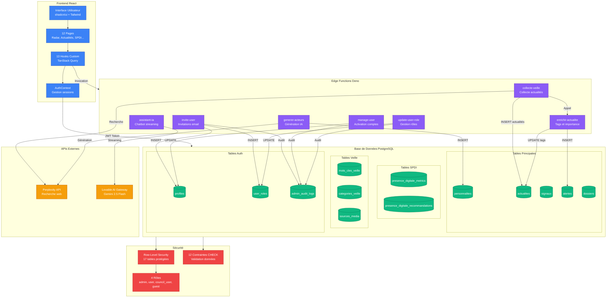
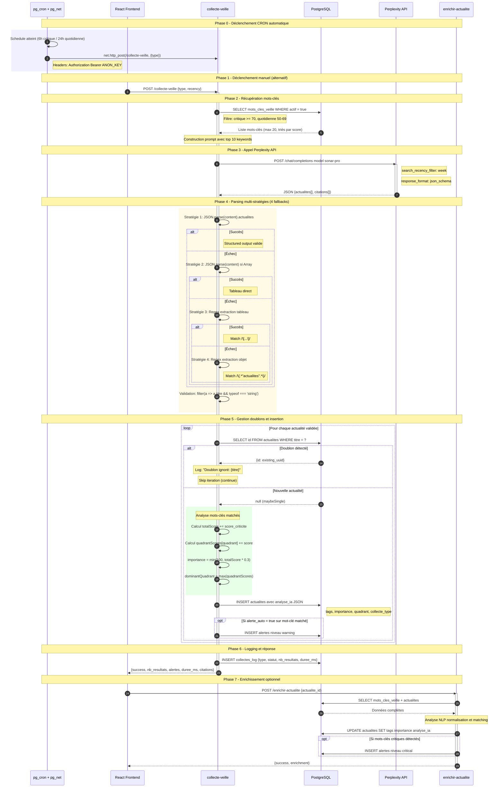
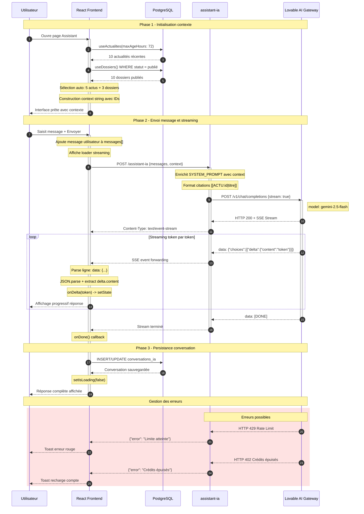
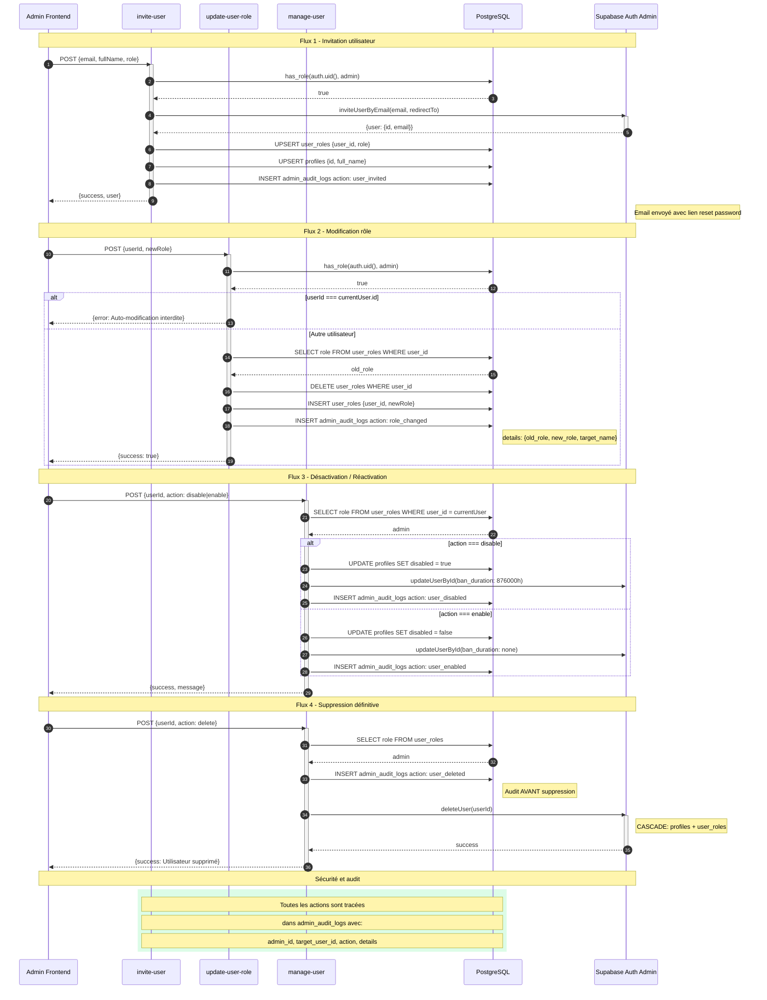
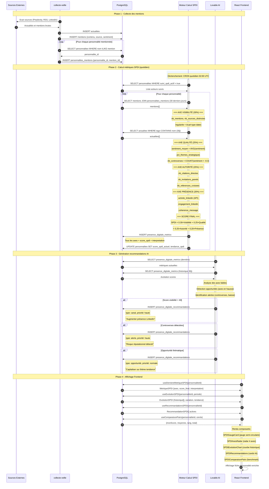
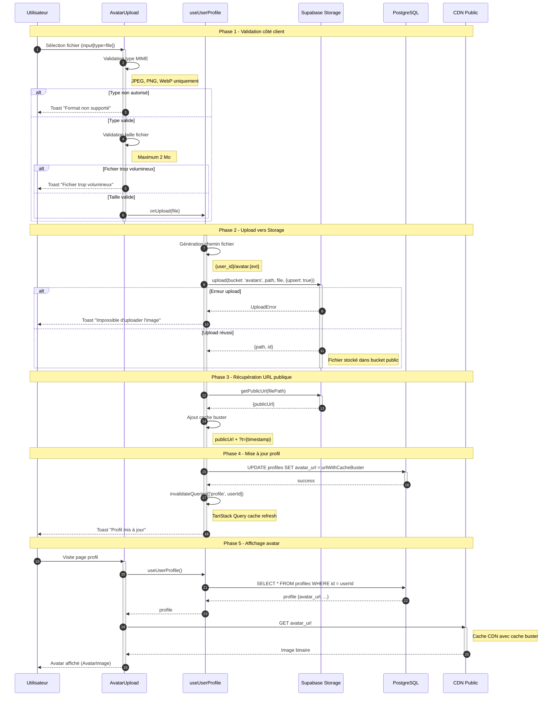

# ANSUT RADAR

**Plateforme de veille stratégique** pour l'Agence Nationale du Service Universel des Télécommunications (ANSUT) de Côte d'Ivoire.

## Périmètre fonctionnel

- 📡 **Radar stratégique** — Signaux classés par quadrant (tech, régulation, marché, réputation)
- 👥 **Suivi des acteurs télécoms** — Personnalités avec Score de Présence Digitale Institutionnelle (SPDI)
- 📰 **Collecte automatisée d'actualités** — Via Perplexity API avec enrichissement IA
- 🔔 **Système d'alertes en temps réel** — Notifications push et historique
- 🤖 **Assistant IA contextuel** — Chatbot stratégique avec streaming
- 📋 **Dossiers analytiques** — Rédaction collaborative en Markdown
- 📊 **Tableaux de bord SPDI** — Métriques, évolution, recommandations

---

## Stack Technique

| Catégorie | Technologies |
|-----------|-------------|
| Frontend | React 18.3, Vite, TypeScript |
| UI | shadcn/ui (Radix UI), Tailwind CSS, Lucide Icons |
| Charts | Recharts |
| Backend | Lovable Cloud (Supabase) |
| Edge Functions | Deno |
| APIs externes | Perplexity API, Lovable AI Gateway (Gemini 2.5 Flash) |
| État | TanStack Query v5, React Context |
| Auth | Supabase Auth + Row-Level Security (RLS) |

---

## Installation Locale

```bash
# Cloner le dépôt
git clone <REPO_URL>
cd ansut-radar

# Installer les dépendances
npm install

# Lancer le serveur de développement
npm run dev
```

### Variables d'environnement

Le fichier `.env` est auto-généré par Lovable Cloud :

```env
VITE_SUPABASE_URL=https://lpkfwxisranmetbtgxrv.supabase.co
VITE_SUPABASE_PUBLISHABLE_KEY=eyJxxx...
VITE_SUPABASE_PROJECT_ID=lpkfwxisranmetbtgxrv
```

### Secrets Edge Functions

Configurés dans Lovable Cloud (Settings > Secrets) :

| Secret | Description |
|--------|-------------|
| `PERPLEXITY_API_KEY` | API Perplexity pour collecte veille |
| `LOVABLE_API_KEY` | Gateway IA (auto-provisionné) |
| `SUPABASE_SERVICE_ROLE_KEY` | Clé admin (auto-provisionné) |

---

## Architecture Dossier

```
src/
├── pages/                        # 12 pages principales
│   ├── Index.tsx                 # Redirection vers /radar
│   ├── RadarPage.tsx             # Dashboard radar stratégique
│   ├── ActualitesPage.tsx        # Fil d'actualités
│   ├── PersonnalitesPage.tsx     # Acteurs + SPDI
│   ├── DossiersPage.tsx          # Dossiers analytiques
│   ├── AssistantPage.tsx         # Chatbot IA
│   ├── AlertesHistoryPage.tsx    # Historique alertes
│   ├── ProfilePage.tsx           # Profil utilisateur
│   ├── AuthPage.tsx              # Authentification
│   ├── ResetPasswordPage.tsx     # Reset mot de passe
│   └── admin/                    # Pages administration
│       ├── UsersPage.tsx         # Gestion utilisateurs
│       ├── MotsClesPage.tsx      # Mots-clés veille
│       ├── ImportActeursPage.tsx # Import acteurs
│       └── AuditLogsPage.tsx     # Logs d'audit
│
├── components/
│   ├── ui/                       # 50+ composants shadcn/ui
│   ├── auth/                     # ProtectedRoute, AdminRoute, LoadingScreen
│   ├── layout/                   # AppLayout, AppSidebar, AppHeader
│   ├── personnalites/            # ActeurCard, ActeurDetail, ActeurFilters
│   ├── actualites/               # FreshnessIndicator
│   ├── spdi/                     # SPDIGaugeCard, SPDIEvolutionChart, etc.
│   ├── assistant/                # ContextSelector, ConversationHistory
│   ├── dossiers/                 # DossierFormDialog, MarkdownEditor
│   ├── notifications/            # AlertNotificationProvider, NotificationCenter
│   └── profile/                  # AvatarUpload, ProfileForm
│
├── hooks/                        # 13 hooks custom
│   ├── usePersonnalites.ts       # CRUD personnalités
│   ├── useActualites.ts          # Liste actualités
│   ├── useAlertesHistory.ts      # Historique alertes
│   ├── useConversationsIA.ts     # Conversations assistant
│   ├── useDossiers.ts            # CRUD dossiers
│   ├── useMotsClesVeille.ts      # Mots-clés admin
│   ├── usePresenceDigitale.ts    # Métriques SPDI
│   ├── useRadarData.ts           # Données radar
│   ├── useRealtimeAlerts.ts      # Alertes temps réel
│   ├── useUserProfile.ts         # Profil utilisateur
│   └── useDeduplicationActeurs.ts# Déduplication import
│
├── contexts/
│   ├── AuthContext.tsx           # Authentification + rôles
│   └── ViewModeContext.tsx       # Mode vue (grid/list)
│
├── types/
│   ├── index.ts                  # Types principaux (Signal, Actualite, etc.)
│   └── json-schemas.ts           # Schémas Zod pour colonnes JSONB
│
└── integrations/supabase/        # Auto-généré (NE PAS MODIFIER)
    ├── client.ts                 # Client Supabase
    └── types.ts                  # Types base de données

supabase/
├── functions/                    # 7 Edge Functions
│   ├── assistant-ia/             # Chatbot IA (streaming SSE)
│   ├── collecte-veille/          # Collecte actualités Perplexity
│   ├── enrichir-actualite/       # Enrichissement tags/importance
│   ├── generer-acteurs/          # Génération acteurs par catégorie
│   ├── invite-user/              # Invitation utilisateur email
│   ├── manage-user/              # Activation/désactivation comptes
│   └── update-user-role/         # Changement rôles
├── migrations/                   # Migrations SQL versionnées
└── config.toml                   # Configuration Supabase
```

---

## Authentification et Rôles

### 4 rôles disponibles

L'enum `app_role` définit les rôles utilisateurs :

| Rôle | Description | Accès |
|------|-------------|-------|
| `admin` | Administrateur | Tout + gestion utilisateurs + audit |
| `user` | Utilisateur standard | Lecture + écriture limitée |
| `council_user` | Membre conseil | Lecture avancée |
| `guest` | Invité | Lecture seule |

### Implémentation sécurisée

```sql
-- Table séparée pour éviter l'escalade de privilèges
CREATE TABLE public.user_roles (
    id UUID PRIMARY KEY DEFAULT gen_random_uuid(),
    user_id UUID REFERENCES auth.users(id) ON DELETE CASCADE NOT NULL,
    role app_role NOT NULL DEFAULT 'user',
    UNIQUE (user_id, role)
);

-- Fonction SECURITY DEFINER pour vérification sans récursion RLS
CREATE FUNCTION public.has_role(_user_id UUID, _role app_role)
RETURNS BOOLEAN
LANGUAGE sql STABLE SECURITY DEFINER
SET search_path = public
AS $$
  SELECT EXISTS (
    SELECT 1 FROM public.user_roles
    WHERE user_id = _user_id AND role = _role
  )
$$;
```

### Routes et protection

```typescript
// Routes publiques
/auth                    // Login / Signup
/auth/reset-password     // Réinitialisation mot de passe

// Routes authentifiées (ProtectedRoute)
/radar                   // Dashboard principal
/actualites              // Fil d'actualités
/personnalites           // Acteurs et SPDI
/dossiers                // Dossiers analytiques
/assistant               // Chatbot IA
/alertes                 // Historique alertes
/profile                 // Profil utilisateur

// Routes admin (AdminRoute - requiert role='admin')
/admin                   // Dashboard admin
/admin/users             // Gestion utilisateurs
/admin/mots-cles         // Configuration mots-clés veille
/admin/import-acteurs    // Import batch acteurs
/admin/audit-logs        // Logs d'audit
```

---

## Architecture Visuelle

### Diagramme système global

Le diagramme ci-dessous illustre les flux de données entre les composants principaux de la plateforme.



### Flux de données principaux

| Flux | Description |
|------|-------------|
| **Collecte automatisée** | `collecte-veille` interroge Perplexity, insère dans `actualites`, déclenche `enrichir-actualite` |
| **Assistant IA** | `assistant-ia` reçoit le contexte, appelle Lovable AI Gateway, stream la réponse SSE |
| **Gestion utilisateurs** | `invite-user`, `manage-user`, `update-user-role` modifient `profiles` et `user_roles` |
| **Alertes temps réel** | Insertion dans `alertes` avec broadcast Realtime vers le frontend |
| **Audit** | Toutes les actions admin sont loguées dans `admin_audit_logs` |

### Flux de collecte automatisée

Ce diagramme de séquence illustre le processus complet de collecte des actualités en 2 phases : la collecte via Perplexity API puis l'enrichissement NLP optionnel.



#### Schedules CRON

| Type | Schedule CRON | Fréquence | Score min | Description |
|------|---------------|-----------|-----------|-------------|
| `critique` | `0 */6 * * *` | Toutes les 6h | 70 | Mots-clés haute priorité |
| `quotidienne` | `0 8 * * *` | 1x/jour à 8h | 50 | Mots-clés priorité moyenne |
| `hebdomadaire` | `0 6 * * 1` | Lundi 6h | 0 | Tous les mots-clés actifs |
| `manuelle` | N/A | Utilisateur | Variable | Déclenchement via UI |

#### Stratégies de parsing JSON

| Ordre | Stratégie | Pattern | Cas d'usage |
|-------|-----------|---------|-------------|
| 1 | JSON structuré | `{actualites: [...]}` | Réponse json_schema Perplexity |
| 2 | Tableau direct | `[...]` | Réponse simplifiée |
| 3 | Regex tableau | `/\[[\s\S]*?\]/` | Markdown avec JSON embedded |
| 4 | Regex objet | `/\{[\s\S]*"actualites"[\s\S]*\}/` | Texte avec JSON embedded |

#### Détection des doublons

| Critère | Méthode | Action si doublon |
|---------|---------|-------------------|
| Titre exact | `eq('titre', actu.titre)` | Skip + log console |
| Résultat | `maybeSingle()` | Retourne `null` ou `{id}` |
| Log | `console.log()` | "Doublon ignoré: {titre truncated}" |

#### Calcul d'importance

| Métrique | Formule | Plafond |
|----------|---------|---------|
| `totalScore` | Somme des `score_criticite` des mots-clés matchés | Aucun |
| `importance` | `Math.min(100, Math.round(totalScore * 0.3))` | 100 |
| `quadrantScores` | Accumulation par quadrant (tech, regulation, market, reputation) | Aucun |
| `dominantQuadrant` | `Object.entries(quadrantScores).sort((a,b) => b[1]-a[1])[0][0]` | N/A |

#### Récapitulatif des phases

| Phase | Composant | Action |
|-------|-----------|--------|
| 0 | pg_cron | Déclenchement automatique selon schedule (6h/24h) |
| 1 | Frontend | Déclenchement manuel via hook `useTriggerCollecte` |
| 2 | collecte-veille | Récupère 20 mots-clés actifs triés par criticité |
| 3 | Perplexity | Recherche web avec `sonar-pro` et filtre 7 jours |
| 4 | collecte-veille | Parse JSON avec 4 stratégies fallback |
| 5 | collecte-veille | Détection doublons par titre + calcul importance |
| 6 | collecte-veille | INSERT actualités + alertes + log |
| 7 | enrichir-actualite | Enrichissement NLP optionnel |

#### Configuration CRON (exemple SQL)

```sql
-- Collecte critique toutes les 6 heures
SELECT cron.schedule(
  'collecte-veille-critique',
  '0 */6 * * *',
  $$
  SELECT net.http_post(
    url := 'https://lpkfwxisranmetbtgxrv.supabase.co/functions/v1/collecte-veille',
    headers := '{"Content-Type": "application/json", "Authorization": "Bearer ANON_KEY"}'::jsonb,
    body := '{"type": "critique"}'::jsonb
  ) AS request_id;
  $$
);

-- Collecte quotidienne à 8h
SELECT cron.schedule(
  'collecte-veille-quotidienne',
  '0 8 * * *',
  $$
  SELECT net.http_post(
    url := 'https://lpkfwxisranmetbtgxrv.supabase.co/functions/v1/collecte-veille',
    headers := '{"Content-Type": "application/json", "Authorization": "Bearer ANON_KEY"}'::jsonb,
    body := '{"type": "quotidienne"}'::jsonb
  ) AS request_id;
  $$
);
```

### Flux de l'assistant IA

Ce diagramme illustre le flux complet de l'assistant IA avec streaming SSE (Server-Sent Events), incluant la contextualisation dynamique des actualités et dossiers, ainsi que le parsing token-by-token côté client.



#### Récapitulatif des étapes

| Étape | Composant | Action |
|-------|-----------|--------|
| 1-4 | Frontend | Charge actualités et dossiers via hooks TanStack Query |
| 5 | Frontend | Sélection auto: 5 actualités + 3 dossiers |
| 6 | Frontend | Construction string context avec IDs pour citations |
| 7 | Frontend | POST vers edge function avec messages + context |
| 8 | assistant-ia | Enrichit SYSTEM_PROMPT avec contexte |
| 9 | assistant-ia | Appel Lovable AI Gateway stream: true |
| 10 | AI Gateway | Retourne flux SSE (Server-Sent Events) |
| 11 | assistant-ia | Forward stream SSE vers client |
| 12 | Frontend | Parse ligne par ligne: data: JSON |
| 13 | Frontend | onDelta(token) met à jour React state |
| 14 | Frontend | Affichage progressif token par token |
| 15 | Frontend | [DONE] déclenche onDone callback |
| 16 | Frontend | Sauvegarde conversation dans conversations_ia |

### Flux de gestion des utilisateurs (Admin)

Ce diagramme illustre les 4 flux de gestion administrative des utilisateurs : invitation, modification de rôle, désactivation/réactivation et suppression. Toutes les actions sont tracées dans la table `admin_audit_logs` pour garantir une traçabilité complète.



#### Récapitulatif des flux

| Flux | Edge Function | Actions principales | Audit Log |
|------|---------------|---------------------|-----------|
| **Invitation** | `invite-user` | inviteUserByEmail + UPSERT profile/role | `user_invited` |
| **Modification rôle** | `update-user-role` | DELETE + INSERT user_roles | `role_changed` |
| **Désactivation** | `manage-user` | UPDATE disabled + ban auth | `user_disabled` |
| **Réactivation** | `manage-user` | UPDATE disabled + unban auth | `user_enabled` |
| **Suppression** | `manage-user` | deleteUser (CASCADE) | `user_deleted` |

#### Rôles disponibles

| Rôle | Label | Description |
|------|-------|-------------|
| `admin` | Administrateur | Accès complet, gestion utilisateurs |
| `user` | Utilisateur | Accès standard aux fonctionnalités |
| `council_user` | Membre du conseil | Accès aux rapports stratégiques |
| `guest` | Invité | Accès lecture seule limité |

#### Mesures de sécurité

- **Vérification admin** : Fonction RPC `has_role()` avec `SECURITY DEFINER`
- **Protection auto-modification** : Un admin ne peut pas modifier son propre rôle/compte
- **Audit préventif** : Logging AVANT les actions destructives (suppression)
- **Bannissement auth** : `ban_duration: 876000h` empêche la reconnexion après désactivation

### Flux SPDI - Score de Présence Digitale Institutionnelle

Le **SPDI** (Score de Présence Digitale Institutionnelle) est un scoring composite à 4 axes permettant de mesurer et suivre la présence digitale des personnalités stratégiques. Le système collecte automatiquement les mentions, calcule les métriques quotidiennement et génère des recommandations personnalisées via l'IA.



#### Les 4 axes du SPDI

| Axe | Poids | Métriques clés | Description |
|-----|-------|----------------|-------------|
| **Visibilité** | 30% | `nb_mentions`, `nb_sources_distinctes`, `regularite_mentions` | Volume et fréquence des mentions dans les médias |
| **Qualité** | 25% | `sentiment_moyen`, `pct_themes_strategiques`, `nb_controverses` | Tonalité et pertinence du contenu |
| **Autorité** | 25% | `nb_citations_directes`, `nb_invitations_panels`, `nb_references_croisees` | Reconnaissance et influence institutionnelle |
| **Présence** | 20% | `activite_linkedin`, `engagement_linkedin`, `coherence_message` | Activité propre sur les réseaux sociaux |

#### Interprétation des scores

| Score | Interprétation | Badge | Action recommandée |
|-------|----------------|-------|-------------------|
| 80-100 | Présence forte | 🟢 Vert | Maintenir la dynamique |
| 60-79 | Présence solide | 🔵 Bleu | Optimiser les axes faibles |
| 40-59 | Visibilité faible | 🟠 Orange | Plan d'action prioritaire |
| < 40 | Risque invisibilité | 🔴 Rouge | Intervention urgente requise |

#### Types de recommandations IA

| Type | Icône | Couleur | Exemple |
|------|-------|---------|---------|
| `opportunite` | 💡 Lightbulb | Vert | "Thème X en tendance, opportunité de prise de parole" |
| `alerte` | ⚠️ AlertTriangle | Rouge | "Controverse détectée, risque réputationnel" |
| `canal` | 🔗 Share2 | Bleu | "Augmenter fréquence posts LinkedIn" |
| `thematique` | 🏷️ Tag | Violet | "Renforcer positionnement sur thème Y" |

#### Hooks React associés

| Hook | Description | Données retournées |
|------|-------------|-------------------|
| `useDerniereMetriqueSPDI` | Dernière mesure SPDI | `MetriqueSPDI` avec axes détaillés |
| `useMetriquesSPDI` | Historique sur période | `MetriqueSPDI[]` (7j/30j/90j) |
| `useEvolutionSPDI` | Évolution et tendance | `EvolutionSPDI` avec variation % |
| `useRecommandationsSPDI` | Recommandations actives | `RecommandationSPDI[]` |
| `useComparaisonPairs` | Benchmark cercle | Score, moyenne, rang, total |
| `useToggleSuiviSPDI` | Activer/désactiver suivi | Mutation toggle |
| `useMarquerRecommandationVue` | Marquer comme lue | Mutation update |

#### Composants SPDI

| Composant | Description |
|-----------|-------------|
| `SPDIGaugeCard` | Jauge semi-circulaire avec score, tendance et interprétation |
| `SPDIAxesRadar` | Graphique radar des 4 axes avec légende |
| `SPDIEvolutionChart` | Courbe d'évolution historique avec sélection de période |
| `SPDIRecommandations` | Liste des recommandations IA avec actions |
| `SPDIComparaisonPairs` | Benchmark vs pairs du même cercle stratégique |
| `SPDIAlerteBanner` | Bannière d'alerte pour variations critiques (≤ -15%) |

### Flux de stockage des fichiers (Storage)

Le système utilise Supabase Storage pour le stockage des fichiers utilisateurs. Actuellement implémenté pour les avatars, l'architecture est extensible pour les documents des dossiers analytiques.



#### Buckets configurés

| Bucket | Public | Usage | Chemin fichiers |
|--------|--------|-------|-----------------|
| `avatars` | ✅ Oui | Photos de profil utilisateurs | `{user_id}/avatar.{ext}` |

#### Validations côté client

| Validation | Valeur | Composant | Message erreur |
|------------|--------|-----------|----------------|
| Types MIME autorisés | `image/jpeg`, `image/png`, `image/webp` | `AvatarUpload` | "Format non supporté" |
| Taille maximum | 2 Mo (2 × 1024 × 1024 bytes) | `AvatarUpload` | "Fichier trop volumineux" |
| Authentification | Utilisateur connecté requis | `useUserProfile` | "Non authentifié" |

#### Méthodes Supabase Storage

| Méthode | Description | Paramètres |
|---------|-------------|------------|
| `upload()` | Upload fichier vers bucket | `bucket`, `path`, `file`, `{upsert}` |
| `getPublicUrl()` | Récupère URL publique CDN | `filePath` |
| `remove()` | Supprime fichier(s) | `paths[]` |
| `list()` | Liste fichiers d'un dossier | `path`, `options` |

#### Composants impliqués

| Composant/Hook | Rôle | Fichier |
|----------------|------|---------|
| `AvatarUpload` | UI upload avec validation et preview | `src/components/profile/AvatarUpload.tsx` |
| `useUserProfile` | Hook avec méthode `uploadAvatar` | `src/hooks/useUserProfile.ts` |
| `ProfilePage` | Page conteneur intégrant l'upload | `src/pages/ProfilePage.tsx` |

#### Cache busting

L'ajout du paramètre `?t={timestamp}` à l'URL publique force le rafraîchissement du cache navigateur et CDN après mise à jour de l'avatar, garantissant l'affichage immédiat de la nouvelle image.

```typescript
const urlWithCacheBuster = `${publicUrl}?t=${Date.now()}`;
```

### Flux d'authentification et gestion des sessions

Le système d'authentification repose sur Supabase Auth avec gestion des rôles (4 niveaux), protection des routes et persistence des sessions via localStorage.

```mermaid
sequenceDiagram
    autonumber
    participant User as Utilisateur
    participant UI as AuthPage
    participant Ctx as AuthContext
    participant Auth as Supabase Auth
    participant DB as PostgreSQL
    participant Router as React Router

    Note over User,Router: Phase 1 - Initialisation session (App mount)

    Ctx->>Auth: getSession()
    activate Ctx
    Auth-->>Ctx: session | null
    
    Ctx->>Ctx: onAuthStateChange(callback)
    Note right of Ctx: Listener actif pour toute la durée de l'app
    
    alt Session existante
        Ctx->>Ctx: setUser(session.user)
        Ctx->>Ctx: setSession(session)
        Ctx->>Ctx: setTimeout(fetchUserRole, 0)
        Note right of Ctx: Defer pour éviter deadlock
        Ctx->>DB: SELECT role FROM user_roles WHERE user_id
        DB-->>Ctx: app_role (admin|user|council_user|guest)
        Ctx->>Ctx: setRole(role)
    else Pas de session
        Ctx->>Ctx: setUser(null), setRole(null)
    end
    Ctx->>Ctx: setIsLoading(false)
    deactivate Ctx

    Note over User,Router: Phase 2 - Protection des routes

    User->>Router: Navigation vers /radar
    activate Router
    Router->>Ctx: ProtectedRoute: useAuth()
    
    alt isLoading = true
        Router-->>User: LoadingScreen
    else !user (non authentifié)
        Router->>Router: Navigate to="/auth" state={from: location}
        Router-->>User: Redirection vers /auth
    else user authentifié
        Router-->>User: Affichage page demandée
    end
    deactivate Router

    User->>Router: Navigation vers /admin/*
    activate Router
    Router->>Ctx: AdminRoute: useAuth()
    
    alt !user
        Router-->>User: Redirection vers /auth
    else !isAdmin (role != 'admin')
        Router->>User: Toast "Accès réservé aux administrateurs"
        Router-->>User: Redirection vers /radar
    else isAdmin
        Router-->>User: Affichage page admin
    end
    deactivate Router

    Note over User,Router: Phase 3 - Connexion utilisateur

    User->>UI: Accès /auth
    activate UI
    
    UI->>Ctx: useAuth() - vérification user
    alt user déjà connecté
        UI->>Router: navigate(from || '/radar')
        Router-->>User: Redirection automatique
    end
    
    User->>UI: Saisie email + password
    UI->>UI: Validation Zod (loginSchema)
    
    alt Validation échouée
        UI-->>User: Affichage erreurs champs
    else Validation réussie
        UI->>Ctx: signIn(email, password)
        Ctx->>Auth: signInWithPassword({email, password})
        
        alt Erreur authentification
            Auth-->>Ctx: AuthError
            Ctx-->>UI: {error}
            UI-->>User: Toast "Erreur de connexion"
        else Succès
            Auth-->>Ctx: {session, user}
            Note over Auth,Ctx: onAuthStateChange déclenché automatiquement
            Ctx->>Ctx: setSession(session), setUser(user)
            Ctx->>DB: fetchUserRole(user.id)
            DB-->>Ctx: role
            Ctx->>Ctx: setRole(role)
            UI-->>User: Toast "Connexion réussie"
            UI->>Router: navigate(from || '/radar')
        end
    end
    deactivate UI

    Note over User,Router: Phase 4 - Réinitialisation mot de passe

    User->>UI: Clic "Mot de passe oublié"
    activate UI
    UI->>UI: setMode('forgot-password')
    
    User->>UI: Saisie email
    UI->>UI: Validation Zod (resetSchema)
    
    UI->>Auth: resetPasswordForEmail(email, {redirectTo})
    Note right of Auth: redirectTo = origin + /auth/reset-password
    
    alt Erreur envoi
        Auth-->>UI: error
        UI-->>User: Toast "Erreur lors de l'envoi"
    else Succès
        Auth-->>UI: success
        Auth->>User: Email avec lien magic link
        UI-->>User: Toast "Email envoyé"
        UI->>UI: setMode('login')
    end
    deactivate UI

    User->>UI: Clic lien email -> /auth/reset-password#access_token=...
    activate UI
    
    UI->>Auth: getSession()
    alt Pas de session ni token
        UI-->>User: Toast "Lien invalide ou expiré"
        UI->>Router: navigate('/auth')
    else Token valide
        User->>UI: Saisie nouveau password + confirmation
        UI->>UI: Validation Zod (refine: passwords match)
        
        UI->>Auth: updateUser({password})
        alt Erreur
            Auth-->>UI: error
            UI-->>User: Toast "Erreur réinitialisation"
        else Succès
            Auth-->>UI: success
            UI-->>User: Vue succès + bouton "Accéder"
            User->>UI: Clic "Accéder à l'application"
            UI->>Router: navigate('/radar')
        end
    end
    deactivate UI

    Note over User,Router: Phase 5 - Déconnexion

    User->>UI: Clic bouton déconnexion
    UI->>Ctx: signOut()
    activate Ctx
    Ctx->>Auth: signOut()
    Auth-->>Ctx: success
    Ctx->>Ctx: setUser(null), setSession(null), setRole(null)
    Note over Auth,Ctx: onAuthStateChange déclenché avec session=null
    deactivate Ctx
    Router->>Router: ProtectedRoute détecte !user
    Router-->>User: Redirection vers /auth
```



#### Rôles utilisateurs

| Rôle | Niveau | Accès | Description |
|------|--------|-------|-------------|
| `admin` | 1 | Toutes pages + /admin/* | Administrateur système |
| `user` | 2 | Toutes pages sauf /admin/* | Utilisateur standard |
| `council_user` | 3 | Pages conseil restreintes | Membre du conseil |
| `guest` | 4 | Lecture seule | Invité sans édition |

#### Routes protégées

| Route | Guard | Redirection si non autorisé | Condition |
|-------|-------|----------------------------|-----------|
| `/radar`, `/actualites`, etc. | `ProtectedRoute` | `/auth` | `!user` |
| `/admin/*` | `AdminRoute` | `/radar` | `!isAdmin` |
| `/auth` | Aucun | `/radar` (si connecté) | `user` |

#### Validations Zod

| Schema | Champs | Règles |
|--------|--------|--------|
| `loginSchema` | email | `trim`, `min(1)`, `email()`, `max(255)` |
| `loginSchema` | password | `min(1)`, `min(6)` |
| `resetSchema` | email | `trim`, `min(1)`, `email()`, `max(255)` |
| `resetPasswordSchema` | password | `min(6)`, `max(72)` |
| `resetPasswordSchema` | confirmPassword | `refine(match password)` |

#### Composants d'authentification

| Composant/Hook | Rôle | Fichier |
|----------------|------|---------|
| `AuthContext` | Provider global session + rôle | `src/contexts/AuthContext.tsx` |
| `useAuth` | Hook d'accès au contexte | `src/contexts/AuthContext.tsx` |
| `AuthPage` | Page login + forgot password | `src/pages/AuthPage.tsx` |
| `ResetPasswordPage` | Page nouveau mot de passe | `src/pages/ResetPasswordPage.tsx` |
| `ProtectedRoute` | Guard routes authentifiées | `src/components/auth/ProtectedRoute.tsx` |
| `AdminRoute` | Guard routes admin | `src/components/auth/AdminRoute.tsx` |
| `LoadingScreen` | Écran chargement vérification | `src/components/auth/LoadingScreen.tsx` |

#### Prévention deadlock

L'utilisation de `setTimeout(fetchUserRole, 0)` dans `onAuthStateChange` évite les appels Supabase imbriqués qui causent des deadlocks :

```typescript
supabase.auth.onAuthStateChange((event, session) => {
  setSession(session);
  setUser(session?.user ?? null);
  
  // Defer Supabase calls with setTimeout
  if (session?.user) {
    setTimeout(() => {
      fetchUserRole(session.user.id).then(setRole);
    }, 0);
  }
});
```

#### Sauvegarde URL origine

Le mécanisme `state={{ from: location }}` préserve l'URL d'origine pour rediriger l'utilisateur vers sa page initiale après connexion :

```typescript
// Dans ProtectedRoute
<Navigate to="/auth" state={{ from: location }} replace />

// Dans AuthPage après connexion réussie
const from = location.state?.from?.pathname || '/radar';
navigate(from, { replace: true });
```

### Schéma de la base de données

Le diagramme ER ci-dessous visualise les 17 tables et leurs relations.


### Légende des groupes de tables

| Groupe | Tables | Description |
|--------|--------|-------------|
| **Auth** | `profiles`, `user_roles` | Gestion des utilisateurs et rôles |
| **Principales** | `personnalites`, `actualites`, `signaux`, `alertes`, `dossiers`, `mentions` | Données métier core |
| **SPDI** | `presence_digitale_metrics`, `presence_digitale_recommandations`, `personnalites_mentions` | Score de Présence Digitale |
| **Veille** | `sources_media`, `categories_veille`, `mots_cles_veille`, `collectes_log` | Configuration collecte |
| **Audit** | `admin_audit_logs`, `audit_consultations`, `conversations_ia`, `config_seuils` | Traçabilité et config |

---

## Schéma des Données

### 17 tables avec RLS activé

#### Tables principales

| Table | Description | Colonnes clés |
|-------|-------------|---------------|
| `personnalites` | Acteurs stratégiques | `cercle` (1-4), `score_spdi`, `categorie`, `niveau_alerte` |
| `actualites` | Articles collectés | `importance` (0-100), `sentiment`, `tags[]`, `analyse_ia` |
| `signaux` | Signaux radar | `quadrant`, `niveau`, `score_impact`, `tendance` |
| `alertes` | Alertes système | `niveau`, `type`, `reference_id`, `lue`, `traitee` |
| `dossiers` | Dossiers analytiques | `statut`, `categorie`, `auteur_id`, `contenu` (Markdown) |
| `mentions` | Mentions détectées | `sentiment`, `est_critique`, `score_influence` |
| `personnalites_mentions` | Liaison N:N | `personnalite_id`, `mention_id` |

#### Tables SPDI

| Table | Description |
|-------|-------------|
| `presence_digitale_metrics` | Métriques journalières (visibilité, qualité, autorité, présence) |
| `presence_digitale_recommandations` | Recommandations IA avec priorité et canal |

#### Tables système

| Table | Description |
|-------|-------------|
| `profiles` | Profils utilisateurs (full_name, avatar_url, department) |
| `user_roles` | Rôles séparés (sécurité anti-escalade) |
| `admin_audit_logs` | Actions administrateur |
| `audit_consultations` | Consultations ressources |
| `collectes_log` | Logs de collecte veille |
| `mots_cles_veille` | Mots-clés de veille avec variantes |
| `categories_veille` | Catégories de veille |
| `sources_media` | Sources médiatiques |
| `config_seuils` | Configuration seuils (JSONB) |

### 12 contraintes CHECK actives

```sql
-- Personnalités
personnalites_cercle_check           -- cercle BETWEEN 1 AND 4
personnalites_niveau_alerte_check    -- IN ('normal', 'eleve', 'critique')
personnalites_tendance_spdi_check    -- IN ('up', 'down', 'stable')
personnalites_categorie_check        -- 9 valeurs enum
personnalites_score_influence_check  -- BETWEEN 0 AND 100

-- Signaux
signaux_niveau_check                 -- IN ('info', 'warning', 'critical')
signaux_quadrant_check               -- IN ('tech', 'regulation', 'market', 'reputation')

-- Alertes
alertes_niveau_check                 -- IN ('info', 'warning', 'critical')

-- Dossiers
dossiers_statut_check                -- IN ('brouillon', 'publie', 'archive')
dossiers_categorie_check             -- IN ('general', 'technique', 'strategique', 'operationnel')

-- Actualités
actualites_importance_check          -- BETWEEN 0 AND 100

-- Recommandations
recommandations_priorite_check       -- IN ('haute', 'normale', 'basse')
```

---

## Workflows Automatisés (Edge Functions)

### Vue d'ensemble

| Fonction | Déclencheur | Description |
|----------|-------------|-------------|
| `collecte-veille` | Manuel / CRON | Collecte actualités via Perplexity API |
| `enrichir-actualite` | Post-insertion | Analyse mots-clés, calcul importance |
| `assistant-ia` | Chat utilisateur | Chatbot streaming SSE via Lovable AI |
| `generer-acteurs` | Manuel admin | Génération acteurs par catégorie |
| `invite-user` | Admin | Invitation utilisateur par email |
| `manage-user` | Admin | Activation/désactivation comptes |
| `update-user-role` | Admin | Modification rôle utilisateur |

### Flux collecte-veille détaillé

```
┌─────────────────────────────────────────────────────────────┐
│  1. Récupération mots-clés actifs (mots_cles_veille)        │
│     └─> Filtre: actif = true                                │
├─────────────────────────────────────────────────────────────┤
│  2. Construction requête Perplexity                         │
│     └─> Mots-clés + variantes + date                        │
├─────────────────────────────────────────────────────────────┤
│  3. Appel Perplexity API (sonar model)                      │
│     └─> Recherche web avec citations                        │
├─────────────────────────────────────────────────────────────┤
│  4. Parsing JSON des résultats                              │
│     └─> Extraction titre, contenu, source_url               │
├─────────────────────────────────────────────────────────────┤
│  5. Insertion actualités en BDD                             │
│     └─> Table: actualites                                   │
├─────────────────────────────────────────────────────────────┤
│  6. Enrichissement IA (enrichir-actualite)                  │
│     └─> Tags, importance, sentiment, analyse_ia             │
├─────────────────────────────────────────────────────────────┤
│  7. Création alertes si mots-clés critiques                 │
│     └─> Table: alertes (si alerte_auto = true)              │
├─────────────────────────────────────────────────────────────┤
│  8. Log dans collectes_log                                  │
│     └─> Statut, durée, nb_resultats                         │
└─────────────────────────────────────────────────────────────┘
```

### Flux assistant-ia

```
Client (React)
    │
    ▼
POST /functions/v1/assistant-ia
    │ body: { messages: [...], context?: string }
    ▼
Edge Function
    │
    ├─> Injection system prompt contextuel
    │   └─> Rôle: analyste veille stratégique ANSUT
    │
    ├─> Appel Lovable AI Gateway
    │   └─> Model: google/gemini-2.5-flash
    │   └─> stream: true
    │
    ▼
SSE Stream → Client
    │
    └─> Rendu token par token (streaming)
```

---

## Logs et Audit

### 3 tables d'audit

| Table | Contenu | Écrivain |
|-------|---------|----------|
| `admin_audit_logs` | Actions admin (CRUD users, rôles, config) | Edge functions admin |
| `audit_consultations` | Consultations ressources (qui a vu quoi) | Application frontend |
| `collectes_log` | Résultats collecte veille | Edge function collecte |

### Structure commune

```sql
-- Colonnes présentes dans toutes les tables d'audit
id              UUID PRIMARY KEY
created_at      TIMESTAMP WITH TIME ZONE
user_id         UUID (nullable)
action          TEXT
metadata        JSONB (détails spécifiques)
ip_address      TEXT (nullable)
```

### Exemples d'actions loguées

```json
// admin_audit_logs
{
  "action": "user_role_updated",
  "admin_id": "uuid-admin",
  "target_user_id": "uuid-user",
  "details": { "old_role": "user", "new_role": "admin" }
}

// collectes_log
{
  "type": "veille_actualites",
  "statut": "success",
  "nb_resultats": 12,
  "duree_ms": 3450,
  "mots_cles_utilises": ["ANSUT", "5G", "régulation"]
}
```

---

## Déploiement

### Frontend

1. Ouvrir le projet dans Lovable
2. Cliquer **Share** > **Publish** > **Update**
3. (Optionnel) **Settings** > **Domains** pour domaine custom

> ⚠️ Les Edge Functions sont déployées automatiquement à chaque commit.

### Configuration production

1. **Auth** : Activer "Leaked Password Protection" dans Settings > Auth
2. **Secrets** : Vérifier `PERPLEXITY_API_KEY` configuré
3. **CRON** : Configurer job collecte-veille si désiré (via pg_cron)

---

## Checklist Pré-production

### Sécurité ✓

- [ ] Protection mots de passe compromis activée (Settings > Auth)
- [ ] RLS vérifiée sur toutes les tables (17/17)
- [ ] Contraintes CHECK actives (12/12)
- [ ] Secrets configurés : `PERPLEXITY_API_KEY`, `LOVABLE_API_KEY`
- [ ] Aucune clé API exposée côté client

### Configuration ✓

- [ ] Au moins 1 compte admin créé
- [ ] Mots-clés de veille configurés (mots_cles_veille)
- [ ] Catégories de veille définies (categories_veille)
- [ ] Sources médias renseignées (sources_media)

### Tests ✓

- [ ] Test collecte-veille exécuté avec succès
- [ ] Test assistant-ia fonctionnel
- [ ] Alertes temps réel vérifiées
- [ ] Import acteurs testé

### Monitoring ✓

- [ ] Logs Edge Functions accessibles (Lovable Cloud > Functions)
- [ ] Audit logs fonctionnels (admin_audit_logs)
- [ ] Métriques SPDI calculées (presence_digitale_metrics)

---

## Commandes utiles

```bash
# Développement
npm run dev              # Serveur local (port 8080)
npm run build            # Build production
npm run preview          # Preview build local

# Lint
npm run lint             # ESLint check
```

---

## Support

- **Documentation Lovable** : https://docs.lovable.dev
- **Supabase Docs** : https://supabase.com/docs
- **shadcn/ui** : https://ui.shadcn.com

---

*Dernière mise à jour : Janvier 2026*
